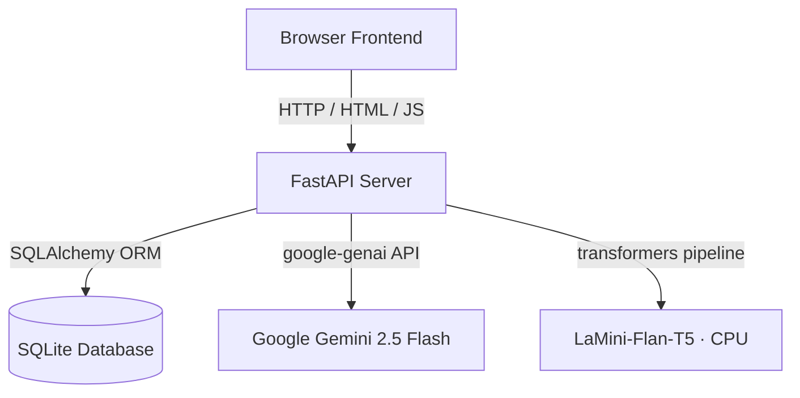

# 🧞 EduGenie — AI-Powered Learning Workspace

<p align="center">
  <b>A production-grade educational platform for students, self-learners, and educators — powered by Google Gemini.</b>
</p>

<p align="center">
  <a href="https://edugenie-gt1e.onrender.com/"></a>
  
  
  
</p>

<p align="center">
  <a href="https://edugenie-gt1e.onrender.com/"><b>Live Demo</b></a> ·
  <a href="#-key-features">Features</a> ·
  <a href="#-getting-started">Getting Started</a> ·
  <a href="#-repository-structure">Structure</a> ·
  <a href="#-roadmap">Roadmap</a>
</p>

---

## Overview

EduGenie is a clean, full-stack educational workspace built with **FastAPI**, **SQLAlchemy**, and a responsive CSS theme engine. It brings tutoring, concept explanation, note summarization, quiz generation, and study-roadmap planning into a single, cohesive desk — backed by Google's Gemini models with local, offline-friendly fallbacks.

## ✨ Key Features

| Feature | Description |
|---|---|
| 🧑‍🏫 **Ask Tutor** | Structured academic answers and code references, cleanly formatted in Markdown |
| 📚 **Concept Explainer** | Breaks topics into Beginner / Intermediate / Advanced difficulty tiers |
| 📝 **Summaries** | Condenses uploaded study material into core concepts and takeaways |
| ✅ **Practice Quizzes** | Generates topic-specific multiple-choice tests with grading and review |
| 🗺️ **Study Roadmaps** | Builds structured learning journeys with steps, milestones, and resources |
| 🕘 **History Canvas** | Saves, loads, and deletes past workspace queries from a SQLite ledger |
| 🎨 **Theme Engine** | Light Mode, Dark Mode, and System Settings, with smooth transitions |

---

## 🏗️ Technical Architecture

### Technology Stack

| Layer | Technology |
|---|---|
| **Backend** | FastAPI (Python 3.10+), Uvicorn |
| **Database** | SQLite + SQLAlchemy ORM |
| **Frontend** | HTML5, CSS3, vanilla JavaScript |
| **AI — Primary** | Google Gemini (`gemini-2.5-flash`) via `google-genai` |
| **AI — Local Fallback** | HuggingFace Transformers (`LaMini-Flan-T5-248M`) |
| **Auth** | JWT (PyJWT) + bcrypt password hashing |



### Security & Performance

1. **Authentication** — Signed JWT tokens stored in `HttpOnly`, `SameSite=Lax` cookies to guard against XSS and CSRF.
2. **Password Safety** — One-way `bcrypt` hashing with per-user salt; plaintext passwords are never stored.
3. **SQL Injection Prevention** — 100% parameterized queries via the SQLAlchemy ORM — no raw string interpolation.
4. **Database Optimization** — Indexes on `user_id` foreign keys across `History`, `Quiz`, and `Roadmap` tables for constant-time user lookups.
5. **Robust Fallbacks** — Lazy singleton AI clients with mock fallbacks, so the app runs instantly even without live API keys.

---

## 📂 Repository Structure

```text
EduGenie/
│   .env                  # Environment secrets (git-ignored)
│   .env.example          # Sample environment configuration
│   .gitignore
│   edugenie.db           # Local SQLite database (git-ignored)
│   README.md
│   requirements.txt
│
├── app/
│   │   auth.py           # Registration, bcrypt verification, JWT issuance
│   │   config.py         # App settings schema (pydantic-settings)
│   │   database.py       # SQLAlchemy engine + lifespan management
│   │   explanation.py    # Concept explainer endpoints
│   │   history.py        # History ledger CRUD
│   │   learning.py       # Study roadmap generator endpoints
│   │   main.py           # App routing, lifespan, HTML views
│   │   models.py         # SQLAlchemy schemas with optimized indexes
│   │   qna.py            # Academic Q&A tutor endpoint
│   │   quiz.py           # MCQ generation and grading
│   │   schemas.py        # Pydantic validation schemas
│   │   summary.py        # Note summarizer (LaMini-T5 pipeline)
│   │
│   └── ai/
│           gemini.py     # Singleton wrapper client for Google Gemini
│           lamini.py     # Lazy CPU loader for HuggingFace Transformers
│           prompts.py    # Standardized system prompts & JSON templates
│
├── static/
│   ├── css/
│   │       styles.css    # Design tokens, themes, animations
│   └── js/
│           main.js       # AJAX bindings, tab switching, SPA-style rendering
│
└── templates/
        dashboard.html    # Main workspace desk
        history.html      # Search log review
        index.html        # Landing / showcase page
        login.html         
        register.html
```

---

## 🚀 Getting Started

### 1. Prerequisites

- **Python 3.10+**
- A free [Google Gemini API key](https://aistudio.google.com/apikey) (optional — the app runs on mock fallbacks without one)

### 2. Clone & Set Up a Virtual Environment

```bash
git clone https://github.com/arun143R/EduGenie-Google-Gemini-Powered-Learning-Assistant.git
cd EduGenie-Google-Gemini-Powered-Learning-Assistant
```

**Linux / macOS**
```bash
python3 -m venv .venv
source .venv/bin/activate
```

**Windows — PowerShell**
```powershell
python -m venv .venv
.\.venv\Scripts\Activate.ps1
```

**Windows — Git Bash**
```bash
source .venv/Scripts/activate
```

### 3. Install Dependencies

```bash
pip install -r requirements.txt
```

### 4. Configure Environment Variables

Copy the example file and fill in your own values:

```bash
cp .env.example .env
```

| Variable | Description | Default |
|---|---|---|
| `DATABASE_URL` | SQLAlchemy database URL | `sqlite:///./edugenie.db` |
| `SECRET_KEY` | JWT signing secret — **required**, generate a strong random string for production | *(empty)* |
| `GEMINI_API_KEY` | Google Gemini API key from [AI Studio](https://aistudio.google.com/apikey) | *(empty)* |
| `GEMINI_MODEL_NAME` | Gemini model identifier | `gemini-2.5-flash` |
| `HF_MODEL_NAME` | Local HuggingFace model for offline inference | `MBZUAI/LaMini-Flan-T5-248M` |
| `USE_LOCAL_MODEL` | Use the local HuggingFace model instead of Gemini | `False` |
| `RUN_HF_MOCK` | Mock mode for HuggingFace — skips downloading the model in dev | `True` |

### 5. Launch the Application

```bash
uvicorn app.main:app --reload
```

Then open:

- **Web App:** [http://127.0.0.1:8000](http://127.0.0.1:8000)
- **API Docs (Swagger):** [http://127.0.0.1:8000/docs](http://127.0.0.1:8000/docs)

---

## 🧪 Testing & Verification

- **Mock Fallbacks** — With `RUN_HF_MOCK=True`, the summarizer runs local mock generation instantly, bypassing CPU-heavy Transformers loading.
- **FastAPI Lifespan** — Startup/shutdown lifespans are handled gracefully, creating database tables dynamically on boot.
- Run the automated test suite with:

```bash
pytest
```

---

## 🗺️ Roadmap

- [ ] **Containerization** — Docker orchestration for streamlined cloud deployment
- [ ] **Vector Database Integration** — RAG (Retrieval-Augmented Generation) over user-uploaded PDF textbooks
- [ ] **API Caching** — Redis cache layer for repetitive academic queries
- [ ] **Managed TTS Narration** — Upgrade demo/voice narration to Google Cloud TTS (WaveNet)

---

## 🤝 Contributing

Contributions, issues, and feature requests are welcome! Feel free to check the [issues page](../../issues) or open a pull request.

## 📄 License

This project is licensed under the MIT License — see the [LICENSE](LICENSE) file for details.

---

<p align="center">Built with ❤️ using FastAPI and Google Gemini</p># EduGenie-Google-Gemini-Powered-Learning-Assistant
